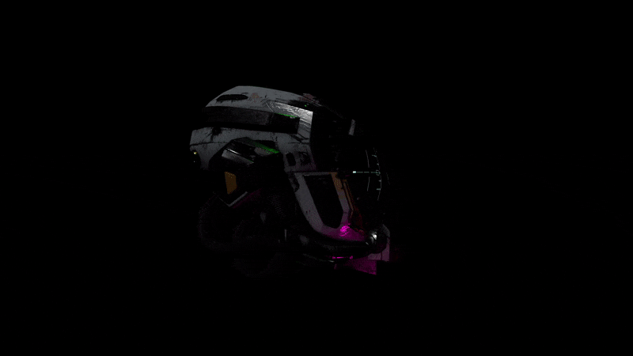

import { Image } from 'astro:assets';
import pbr1 from '../../assets/projects/pbr/pbr1.gif';
import pbr2 from '../../assets/projects/pbr/pbr2.gif';
import pbr3 from '../../assets/projects/pbr/pbr3.gif';
import pbr4 from '../../assets/projects/pbr/pbr4.gif';

##### Physically based rendering with direct and image-based lighting implemented in a custom engine (PS5)

This project is a part of my learning experience as a second-year student at Breda University of Applied Sciences. At the start of the project I was provided with a game engine without any renderering components. My goal was to build a physically-based renderer using modern graphics API. This was a solo prject to gain an understanding of console-specific low-level API as well as to learn about the physics of light interaction. The project includes loading GLTF model and renderering it with normal mapping apling principles from physically and image based shading.

##### Direct lighting:

##### Image-based lighting:

##### Team Size:
* Solo project

##### Time Bounds:
* 2 months

##### By the end of the project I gained knowledge in:		
* Modern rendering API
* Applied PBR
* Image-based lighting
* GPU architecture
* Linear algebra and trigonometry
* Working with custom engines

  <Image src={pbr4} alt="" width={300} />
  <Image src={pbr2} alt="" width={300} />
  <Image src={pbr3} alt="" width={300} />
  <Image src={pbr1} alt="" width={300} />

This project is a part of my learning experience as a second-year student at Breda University of Applied Sciences. 
